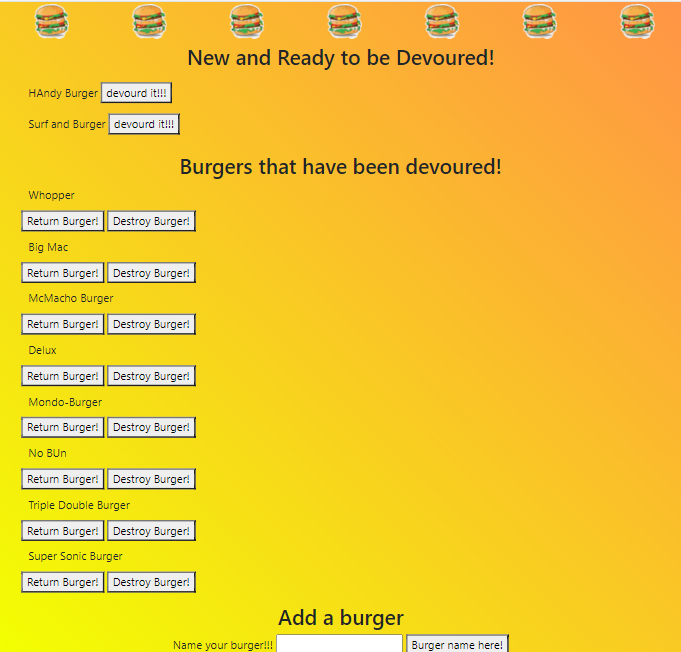

# burger# Node Express Handlebars

This application is a restaurant app that lets users input the name of burgers they'd like to eat.
WHEN a user submits a burger's name, the app will display the burger in the New and Ready to be Devoured!
Each burger in the waiting area also has a `Devour it!` button. WHEN the user clicks it, the burger will move down to the Burgers that have been devoured section.
Once the burger has been moved to the Burgers that have been devoured section there will be 2 buttons one lets the user return the burger to the New and Ready to be Devoured section or the Destroy Burger removes it from the Database. 

# Technologies Used
This is a burger logger that uses MySQL, Node, Express, Handlebars and a homemade ORM (yum!).

# Live Link

[Name-A-Burger-App](https://name-a-burger.herokuapp.com/)

# Screenshot

 

